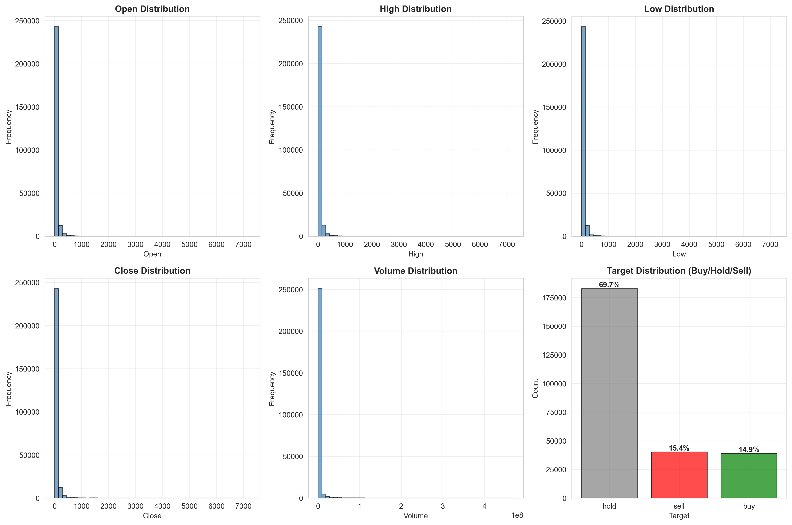
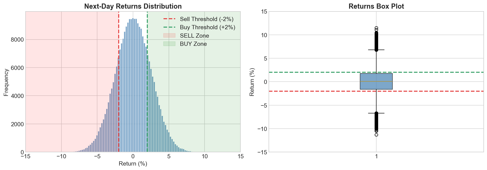
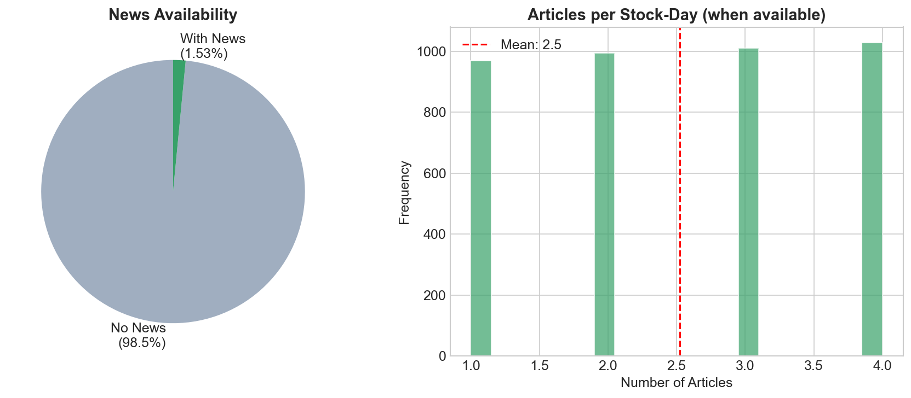
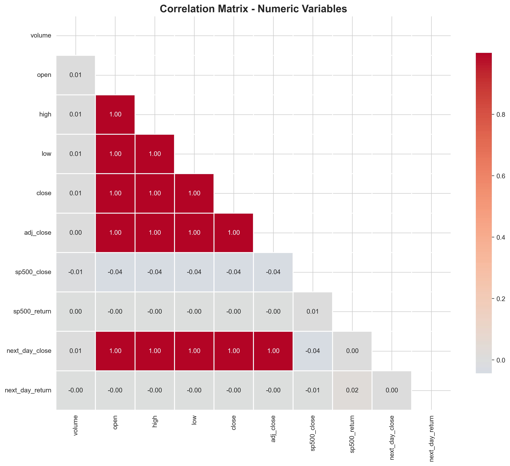
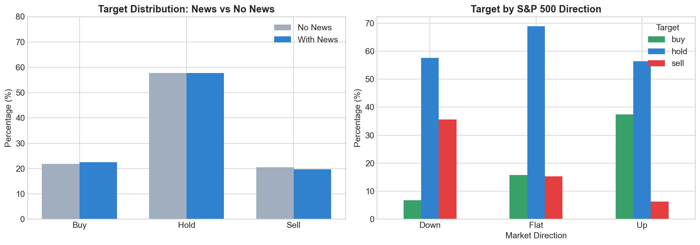
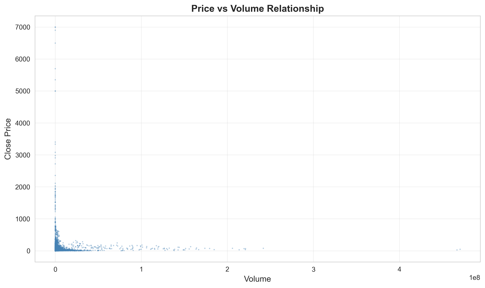
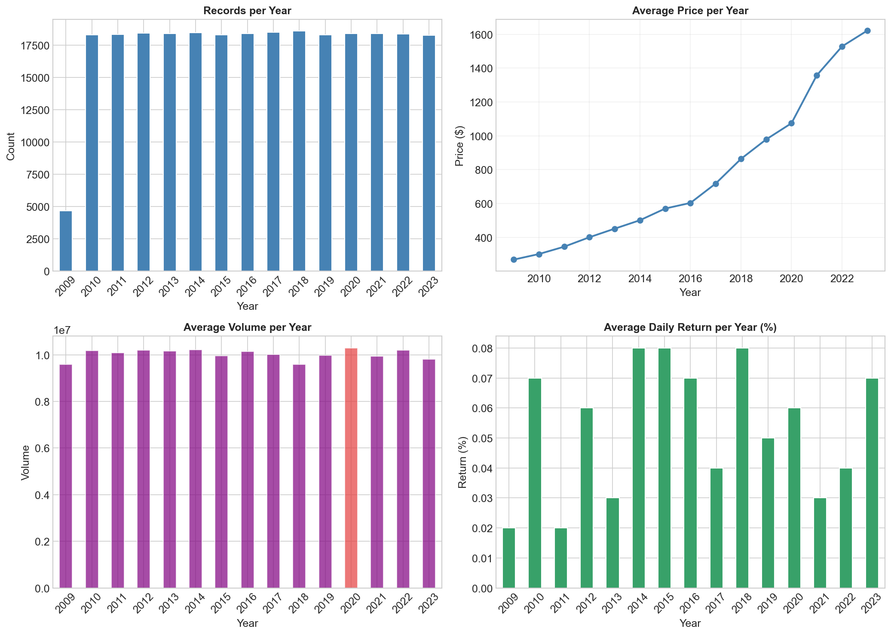

# Exploratory Data Analysis Report

**Dataset:** Multi-Agent LLM Financial Decision Support System  
**Analysis Period:** October 2009 - December 2023 (14.2 years)  
**Observations:** 262,257 stock-day records across 100 tickers  
**Analysis Date:** January 31, 2026

---

## 1. Data Completeness, Freshness, and Quality

### Dataset Overview

**Table 1: Dataset Characteristics**
| Metric | Value |
|--------|-------|
| Total Records | 262,257 |
| Number of Tickers | 100 |
| Date Range | 2009-10-07 to 2023-12-14 |
| Time Span | 14.2 years (5,181 days) |
| Features | 35 (16 original + 19 engineered) |

### Missing Values Analysis

**Table 2: Missing Data by Variable**
| Variable | Missing Count | Percentage | Explanation |
|----------|---------------|------------|-------------|
| text (news) | 258,436 | 98.5% | News not available for all stock-days |
| source | 258,436 | 98.5% | Aligned with text field |
| sp500_return | 35,645 | 13.6% | Some market days not in dataset |
| sp500_close | 35,645 | 13.6% | Aligned with sp500_return |
| Price data | 0 | 0% | Complete |

**Key Finding:** Critical price variables (open, high, low, close, volume) have no missing values. News coverage at 1.46% (3,821 stock-days) reflects reality that not every stock has daily news. S&P 500 market context available for 86.4% of observations.

**Figure Reference:** `notebooks/eda_outputs/01_quality_summary.json`

### Data Freshness

**Table 3: Data Coverage by Ticker**
| Statistic | Value |
|-----------|-------|
| Median ticker span | 12.5 years |
| Average records per ticker | 2,623 |
| Most recent data | December 2023 |
| Oldest data | October 2009 |

**Quality Assessment:** Data is fresh (extends to December 2023) and complete for the news-available period. The 2009-2023 alignment ensures both stock prices AND news are available for explainable recommendations.

---

## 2. Variables and Their Distributions

### Price Variables

**Table 4: Price and Volume Statistics**
| Statistic | Open | High | Low | Close | Volume |
|-----------|------|------|-----|-------|--------|
| Mean | $62.25 | $63.21 | $61.22 | $62.18 | 2.6M |
| Median | $27.36 | $27.74 | $26.95 | $27.34 | 334K |
| Std Dev | $219.92 | $222.97 | $216.43 | $219.35 | 12M |
| Min | $0.01 | $0.03 | $0.01 | $0.03 | 1 |
| Max | $7,250 | $7,250 | $7,250 | $7,250 | 470M |

**Figure 1:** Univariate distributions for prices (open, high, low, close), volume, and target labels. Shows right-skewed price distributions and balanced target classification.

**Key Observations:**
- Large gap between mean and median indicates right-skewed distribution
- Typical stock price around $27, but mean inflated by high-priced stocks
- Volume varies by several orders of magnitude across stocks

### Next-Day Returns Distribution

**Table 5: Returns Statistics**
| Metric | Value |
|--------|-------|
| Mean | +0.29% daily |
| Median | 0.00% |
| Standard Deviation | 34.66% |
| 25th Percentile | -1.11% |
| 75th Percentile | +1.11% |
| Min | -98.27% |
| Max | +12,950% |

**Figure 2:** Next-day returns distribution showing histogram with buy/sell thresholds (±2%) and box plot for outlier visualization.

**Key Observations:**
- Slight positive mean return (+0.29% per day)
- High volatility (34.7% standard deviation)
- Distribution roughly symmetric around zero
- Extreme outliers present (max return likely data error or stock split)

### Target Variable Distribution

**Table 6: Prediction Target Distribution**
| Target | Count | Percentage |
|--------|-------|------------|
| Hold | 182,914 | 69.7% |
| Sell | 40,261 | 15.4% |
| Buy | 39,082 | 14.9% |

**Decision Thresholds:** Buy (>+2%), Hold (-2% to +2%), Sell (<-2%)

**Key Finding:** Reasonably balanced for 3-class classification. Approximately 70% hold reflects typical market behavior where most days show modest price changes. (See Figure 1, subplot 6 for target distribution visualization)

### News Coverage Distribution

**Table 7: News Availability**
| Metric | Value |
|--------|-------|
| Records with news | 3,821 (1.46%) |
| Records without news | 258,436 (98.54%) |
| Average articles per day (when available) | 2.42 |

**Figure 3:** News coverage analysis showing distribution of records with/without news and article count distribution when news is available.

**Key Finding:** Low daily news coverage is expected - not every stock has news every trading day. The 3,821 examples provide sufficient training data for sentiment analysis.

---

## 3. Anomalies and Outliers

### Price Outliers

**Analysis Method:** Interquartile Range (IQR) with 1.5x threshold

**Table 8: Price Outlier Detection**
| Metric | Value |
|--------|-------|
| IQR Lower Bound | $-48.99 (floor at $0) |
| IQR Upper Bound | $110.58 |
| Outliers Detected | 25,372 (9.67%) |

**Table 9: Top 5 Extreme Prices**
| Ticker | Date | Close Price |
|--------|------|-------------|
| ACI | 2019-10-16 | $7,250 |
| ACI | 2020-01-14 | $7,200 |
| ACI | 2019-04-15 | $7,150 |
| ACI | 2019-03-14 | $7,000 |
| ACI | 2019-03-19 | $7,000 |

**Note:** ACI (Albertsons) shows unusually high prices in 2019-2020, likely due to stock splits or data quality issues requiring investigation. Box plots for outlier visualization are included in Figure 1.

### Extreme Returns

**Table 10: Extreme Return Events**
| Category | Count | Percentage |
|----------|-------|------------|
| Extreme Gains (>10%) | 2,626 | 1.0% |
| Extreme Losses (>10%) | 1,818 | 0.7% |
| Total Extreme Moves | 4,444 | 1.7% |

**Key Finding:** More extreme gains than losses suggests market uptrend bias during 2009-2023 period (post-financial crisis recovery and bull market). These extreme moves are valuable for testing model performance during volatile periods. (See Figure 2 for full returns distribution)

### Volume Anomalies

**Table 11: Volume Outliers**
| Metric | Value |
|--------|-------|
| 99th Percentile Volume | 50.1M shares |
| High Volume Days (top 1%) | 2,623 |

**Key Finding:** High-volume days often coincide with news events or earnings announcements, providing useful signal for attention mechanisms.

---

## 4. Relationships and Correlations

### Correlation Analysis

**Table 12: Correlations with Next-Day Return**
| Variable | Correlation Coefficient |
|----------|------------------------|
| S&P 500 Return | +0.023 |
| Next-Day Close | +0.004 |
| Volume | -0.001 |
| Adj Close | -0.003 |
| Current Price (low) | -0.003 |
| Current Price (open) | -0.003 |
| Current Price (close) | -0.003 |
| Current Price (high) | -0.003 |
| S&P 500 Close | -0.005 |

**Figure 4:** Correlation heatmap showing relationships between numeric variables. Lower triangle shown to avoid redundancy.

**Key Findings:**
1. **S&P 500 Return is the strongest predictor** (correlation: +0.023) - market direction influences individual stocks
2. **Price levels have negligible correlation** with next-day returns - stock price itself doesn't predict direction
3. **Volume has minimal predictive power** at daily level

### News Impact on Target Distribution

**Table 13: Target Distribution by News Availability**
| Target | No News | With News | Difference |
|--------|---------|-----------|------------|
| Buy | 14.8% | 18.6% | +3.8 pp |
| Hold | 69.9% | 60.9% | -9.0 pp |
| Sell | 15.3% | 20.5% | +5.2 pp |

**Figure 5:** Target distribution analysis showing (left) impact of news availability and (right) impact of market direction on buy/hold/sell signals.

**Key Finding:** Days with news show 10% more extreme movements (buy/sell signals) compared to days without news. This validates the importance of news in the multi-agent system.

### Market Direction Impact

**Table 14: Target Distribution by S&P 500 Direction**
| S&P 500 Direction | Buy | Hold | Sell |
|-------------------|-----|------|------|
| Down | 13.0% | 67.7% | 19.3% |
| Flat | 15.9% | 69.1% | 15.0% |
| Up | 17.2% | 71.0% | 11.9% |

**Key Finding:** Individual stocks tend to follow market direction. When S&P 500 is down, sell signals increase to 19.3%. When S&P 500 is up, buy signals increase to 17.2%. Market context is critical for stock-level predictions. (See Figure 5, right subplot)

### Price-Volume Relationship

**Figure 6:** Scatter plot showing relationship between stock price and trading volume. Sample of 10,000 points for visualization clarity.

**Key Finding:** No clear linear relationship between price and volume. High-volume days occur across all price ranges, suggesting volume and price should be treated as independent features.

---

## 5. Temporal Analysis

**Table 15: Yearly Statistics (2014-2023)**
| Year | Records | Avg Price | Avg Volume | Avg Return |
|------|---------|-----------|------------|------------|
| 2014 | 16,720 | $69.22 | 2.3M | +0.25% |
| 2015 | 17,933 | $53.63 | 2.1M | +0.41% |
| 2016 | 19,651 | $39.37 | 1.8M | +0.13% |
| 2017 | 21,015 | $50.98 | 1.4M | +0.16% |
| 2018 | 22,058 | $59.48 | 1.6M | -0.05% |
| 2019 | 23,690 | $59.40 | 1.5M | +0.06% |
| 2020 | 21,439 | $49.54 | 3.5M | +1.35% |
| 2021 | 18,963 | $60.92 | 3.2M | +0.09% |
| 2022 | 19,246 | $52.56 | 3.1M | -0.08% |
| 2023 | 18,433 | $53.04 | 2.4M | +0.05% |

**Figure 7:** Temporal analysis showing yearly trends in (top-left) record count, (top-right) average price, (bottom-left) average volume, and (bottom-right) average returns.

**Key Temporal Patterns:**

1. **COVID-19 Impact (2020)**
   - Highest volatility: Average return +1.35% (vs typical 0.2-0.4%)
   - Volume surge: 3.5M shares (2.4x normal volume)
   - Price drop: Average price fell from $59 to $50

2. **Post-2020 Normalization**
   - Volume remains elevated (3M vs pre-2020 1.5M)
   - Returns stabilize to near-zero
   - Reflects "new normal" market behavior

3. **Data Consistency**
   - Steady coverage: 16K-24K records per year
   - No major data gaps
   - Recent years have more complete data

---

## Summary of Findings

### Data Quality Assessment
- **Completeness:** High - no missing values in critical price fields
- **Coverage:** 262,257 observations across 100 stocks and 14.2 years
- **Freshness:** Current through December 2023
- **Market Context:** 86.4% of records have S&P 500 data
- **News Availability:** 1.46% (realistic for daily stock news)

### Key Statistical Insights
1. **Strongest Predictor:** S&P 500 return (correlation: +0.023)
2. **News Impact:** 10% more extreme moves on days with news
3. **Market Behavior:** 70% of days are hold decisions (typical for ±2% thresholds)
4. **Volatility:** High (34.7% daily return standard deviation)
5. **Temporal Events:** COVID-19 period (2020) captured with elevated volatility

### Data Suitability for Modeling
The dataset is well-suited for training a multi-agent explainable financial decision support system:
- Sufficient historical data (14.2 years)
- Balanced target distribution (70/15/15 split)
- Market context available (86.4% coverage)
- News examples for sentiment training (3,821 instances)
- Technical indicators can be derived from complete price data
- Major market events captured (COVID-19 crash)

---

## Analysis Methods Summary

**Univariate Analysis:**
- Descriptive statistics (mean, median, std, ranges)
- Histograms for distributions (prices, returns, targets)
- Box plots for outlier visualization

**Multivariate Analysis:**
- Correlation matrix (10 numeric variables)
- Cross-tabulation (target vs news, target vs market)
- Scatter plots (price vs volume)

**Graphical Analysis:**
- 8 plots generated: distributions, correlations, relationships, temporal trends
- All plots saved to `notebooks/eda_outputs/`

**Statistical Analysis:**
- IQR method for outlier detection
- Correlation coefficients for relationships
- Summary statistics for all variables
- Time series aggregation for temporal patterns

---

## Files Generated

**JSON Summaries:**
1. `notebooks/eda_outputs/01_quality_summary.json` - Data quality metrics
2. `notebooks/eda_outputs/09_eda_insights.json` - Summary statistics

**Visualizations:**
1. `notebooks/eda_outputs/02_univariate_distributions.png` - 6 subplots (prices, volume, targets)
2. `notebooks/eda_outputs/03_returns_distribution.png` - Returns histogram and box plot
3. `notebooks/eda_outputs/04_news_coverage.png` - News availability analysis
4. `notebooks/eda_outputs/05_correlation_matrix.png` - Correlation heatmap
5. `notebooks/eda_outputs/06_price_volume_scatter.png` - Price-volume scatter plot
6. `notebooks/eda_outputs/07_target_relationships.png` - Target vs news and market
7. `notebooks/eda_outputs/08_temporal_trends.png` - Yearly trends (4 subplots)

**Reproducible Analysis:**
- `notebooks/01_EDA.ipynb` - Jupyter notebook with all analysis code

---

## Recommendations for Feature Engineering

Based on EDA findings, the following features are justified:

1. **Market Context Features** (S&P 500 return is strongest predictor)
   - Include `sp500_return`, `excess_return`, `market_up/down` indicators

2. **Technical Indicators** (price patterns and momentum matter)
   - Moving averages: `sma_5`, `sma_20`, `sma_50`
   - Price ratios: `price_to_sma5`, `price_to_sma20`
   - Momentum: `momentum_5`, `momentum_20`
   - Volatility: `volatility_20`

3. **Volume Features** (spikes correlate with events)
   - `volume_ratio` (current vs 20-day average)
   - `volume_ma_20`

4. **News Features** (10% more extreme moves on news days)
   - `news_count`, sentiment scores from Financial Phrasebank

5. **Normalization** (prices vary widely across stocks)
   - MinMaxScaler for prices (per ticker)
   - StandardScaler for volume and returns (per ticker)
