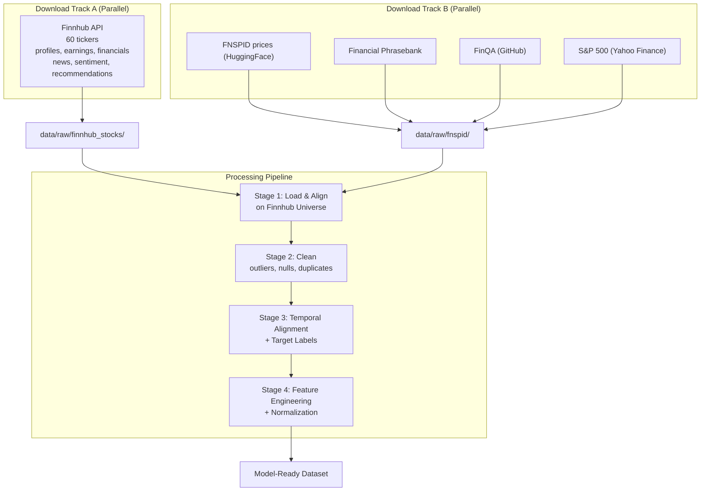
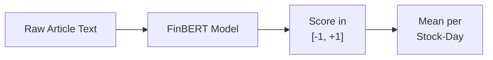
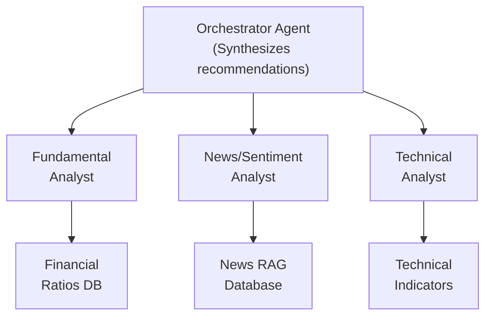

# DSC288 Capstone Progress Report
## Multi-Agent LLM Framework for Explainable Financial Decision Support

**Team:** Group 10  
**Team Members:** Harsh Arya, Gabrielle Despaigne, Camila Paik, Raghav Vasappanavara  
**Course:** DSC288 - Capstone Project  
**Institution:** UC San Diego  
**Report Date:** February 2026

---

## 1. Background

**Problem Statement:** Retail investors increasingly rely on algorithmic trading systems and AI-powered financial advisors, yet most existing solutions provide opaque "black-box" predictions without explaining the reasoning behind buy, hold, or sell recommendations. This lack of transparency erodes trust and prevents users from developing financial literacy or understanding market dynamics.

**Why This Problem Matters:** Our project addresses this critical gap by developing a multi-agent LLM-based system that prioritizes **explainability over pure trading performance**. The system provides buy/hold/sell recommendations accompanied by natural language explanations grounded in cited sources using Retrieval-Augmented Generation (RAG). This approach empowers intermediate and beginner retail investors to not only receive actionable recommendations but also understand the fundamental, technical, and sentiment-based reasoning behind each decision. By leveraging OpenAI GPT-5.2 and the OpenAI Agents SDK, we aim to create specialized agents (fundamental analyst, news/sentiment analyst, technical analyst, optimistic/cautious viewpoints) that collaboratively generate interpretable recommendations with complete data provenance.

---

## 2. Dataset Name and Citation/Link

We utilize five datasets spanning price history, fundamentals, news, sentiment labels, and financial reasoning:

### 2.1 Finnhub Financial Data (Primary)
- **Description:** Comprehensive fundamental data for 60 tickers across finance, semiconductor, and biotech sectors. Includes company profiles, quarterly earnings, financial metrics, analyst recommendations, company news (30-day window), news sentiment scores, and insider sentiment.
- **Source:** https://finnhub.io (Fundamental-1 plan, API)
- **Usage:** Primary stock universe definition (60 tickers, 3 sectors), fundamental features, news articles, and sentiment scores for the multi-agent system
- **Size:** 60 company profiles, 220 earnings records, 8,344 news articles, 52 sentiment scores, 9 data types per ticker

### 2.2 FNSPID (Financial News and Stock Price Integration Dataset)
- **Description:** Historical daily OHLCV stock prices for thousands of tickers
- **Source:** https://huggingface.co/datasets/Zihan1004/FNSPID
- **Citation:** Dong, Z. et al. (2023). "FNSPID: A Comprehensive Financial News and Stock Price Integration Dataset for AI-based Financial Analysis." *HuggingFace Datasets*
- **Usage:** Historical price data for the 58 Finnhub tickers with available coverage (2 tickers -- ARM, MRNA -- lack FNSPID history due to recent IPOs)
- **Size:** 439,931 daily price records across 58 tickers (7,693 total CSVs available)

### 2.3 Financial Phrasebank
- **Description:** Sentiment-labeled financial news sentences with human annotations at four agreement levels (50%, 66%, 75%, 100% annotator agreement)
- **Source:** https://huggingface.co/datasets/takala/financial_phrasebank
- **Citation:** Malo, P. et al. (2014). "Good Debt or Bad Debt: Detecting Semantic Orientations in Economic Texts." *Journal of the Association for Information Science and Technology*, 65(4), 782-796.
- **Usage:** Training and validation data for FinBERT sentiment model
- **Size:** 4 agreement levels; primary subset (AllAgree, 100% consensus): 2,264 sentences

### 2.4 Yahoo Finance S&P 500
- **Description:** Historical S&P 500 market index data
- **Source:** https://finance.yahoo.com/quote/%5EGSPC/history/
- **Usage:** Market context features for relative performance analysis
- **Size:** 6,289 trading days (1999--2023)

### 2.5 FinQA
- **Description:** Financial question-answering benchmark requiring multi-step numerical reasoning over financial tables
- **Source:** https://github.com/czyssrs/FinQA
- **Citation:** Chen, Z. et al. (2021). "FinQA: A Dataset of Numerical Reasoning over Financial Data." *EMNLP 2021*
- **Usage:** Evaluation of the Graph RAG system's financial reasoning faithfulness
- **Size:** 8,281 Q-A pairs (6,251 train, 883 validation, 1,147 test)

---

## 3. Data Pipeline

### 3.1 Purpose

The data pipeline aligns structured market data (OHLCV prices, fundamentals, earnings) with unstructured financial text (news articles, sentiment scores) for 60 tickers across three sectors (finance, semiconductor, biotech). The pipeline produces a model-ready dataset where every stock-day record can be enriched with Finnhub fundamentals and potentially explained using retrieved news sources via RAG.

### 3.2 Stock Universe Definition

The stock universe is defined by **60 tickers sourced from Finnhub** across three high-activity sectors:

| Sector | Count | Representative Tickers |
|--------|-------|----------------------|
| Finance | 20 | JPM, GS, V, MA, BAC, WFC, BLK, SCHW, AXP, C |
| Semiconductor | 20 | NVDA, AMD, TSM, AVGO, QCOM, TXN, AMAT, LRCX, KLAC, MU |
| Biotech | 20 | AMGN, GILD, REGN, VRTX, MRNA, BIIB, ILMN, BMRN, ALNY, INCY |

This selection is deterministic and reproducible. Historical OHLCV prices are loaded from FNSPID for the **58 tickers with available price history** (ARM and MRNA lack FNSPID coverage due to recent IPOs).

### 3.3 Pipeline Architecture

The pipeline consists of **two parallel download tracks** followed by **four processing stages**:

**Download orchestration** (`scripts/download_all_data.py`) runs all four download scripts in parallel using Python subprocesses with real-time progress output.

#### Stage 1: Data Loading
- **Script:** `scripts/01_load_data.py`
- Loads FNSPID price CSVs for the 58 Finnhub-matched tickers
- Loads Finnhub fundamentals (profiles, earnings, financials, news, sentiment) from JSON
- Loads S&P 500 index history, Financial Phrasebank, and FinQA

| Source | Records | Coverage |
|--------|---------|----------|
| FNSPID Prices (58 tickers) | 439,931 | Daily OHLCV 1999--2023 |
| Finnhub Profiles | 60 | Market cap, industry, IPO |
| Finnhub Earnings | 220 | Quarterly EPS surprise |
| Finnhub News | 8,344 | 30-day article window |
| Finnhub Sentiment | 52 | Bullish/bearish scores |
| S&P 500 | 6,289 | Daily close 1999--2023 |

#### Stage 2: Data Cleaning
- **Script:** `scripts/02_clean_data.py`
- **Outlier removal:** Records with daily price change >50% are removed. With the curated Finnhub universe (large-cap, liquid stocks), only **34 records (0.008%)** exceed this threshold -- all are data errors, not real market events. Legitimate extreme moves (COVID-19, earnings surprises) fall in the 10--50% range and are retained (**5,482 records, 1.2%**).
- **Volume filter:** Records with zero or negative volume removed (**2,489 records**)
- **Date standardization:** All dates unified to YYYY-MM-DD

#### Stage 3: Temporal Alignment + Target Labels
- **Script:** `scripts/03_align_data.py`
- **News aggregation rule:** When multiple news articles exist for one stock-day, all article texts are concatenated using a ` | ` separator and `news_count` stores the count. When no news exists, `text = NaN` and `news_count = 0`; the row is preserved via a left join on prices.
- **S&P 500 merge:** Market returns joined on date for relative performance analysis
- **Target variable (fixed thresholds, not tuned):**

| Target | Rule | Distribution |
|--------|------|-------------|
| **BUY** | Next-day return > +2% | 17.0% |
| **HOLD** | -2% <= next-day return <= +2% | 66.9% |
| **SELL** | Next-day return < -2% | 16.1% |

The +/-2% threshold represents a meaningful single-day move that justifies a trading action. The class imbalance (67% HOLD) is expected -- most trading days are unremarkable.

- **No look-ahead bias:** `next_day_return` is computed from T+1 close vs T close. The temporal split ensures train data never sees future prices.

#### Stage 4: Feature Engineering
- **Script:** `scripts/04_feature_engineering.py`
- **Rolling window guarantee:** All rolling features (SMA-5, SMA-20, SMA-50, momentum, volatility) use only past trading days. The first 50 rows per ticker are dropped after computation to ensure every SMA-50 value reflects a true 50-day average (~1.9% record loss).
- **Normalization:** Scalers are fitted on the **training split only** and applied via `transform()` to validation and test sets. Forward-fill is applied independently within each split to prevent leakage.
- **Technical Indicators (9):** SMA-5, SMA-20, SMA-50, momentum-5, momentum-20, volatility-20, volume-ratio, volume-MA-20, price-to-SMA ratios
- **Market-Relative Features (4):** S&P 500 return, excess return, market-up, market-down

### 3.4 Description of Outputs

| Metric | Value |
|--------|-------|
| Total Observations | 439,931 price records |
| Tickers | 58 (Finnhub universe, FNSPID-matched) |
| Sectors | 3 (finance, semiconductor, biotech) |
| Time Period | 1999--2023 |
| Finnhub Fundamentals | 9 data types per ticker |
| Target Distribution | 17% buy / 67% hold / 16% sell |

**Temporal Split (fixed cutoffs, no shuffling):**

| Split | Date Range | Purpose |
|-------|-----------|---------|
| Train | Through Dec 31, 2021 | Model training |
| Validation | Jan 1 -- Dec 31, 2022 | Hyperparameter tuning |
| Test | Jan 1 -- Dec 14, 2023 | Final evaluation |

---

## 4. EDA Description

### 4.1 EDA Pipeline Organization

The EDA is implemented as a single executable notebook (`eda/01_EDA.ipynb`) run end-to-end by `eda/run_eda.py`. It loads all five raw datasets directly, performs cross-dataset analysis, and produces 10 output artifacts (8 visualizations, 1 JSON insights file, 1 anomaly CSV). The pipeline takes ~17 seconds to execute.

**EDA Sections:**

| Section | Analysis | Datasets Used |
|---------|----------|---------------|
| 1. Setup | Data inventory, path verification | All |
| 2. Load & Align | Price history for 58 Finnhub tickers | FNSPID + Finnhub |
| 3. Data Quality | Missing values, completeness, coverage | FNSPID |
| 4. Outlier Analysis | Return threshold justification | FNSPID |
| 5. Target Variable | +/-2% sensitivity, sector breakdown | FNSPID |
| 6. Fundamentals | Profiles, earnings, news, sentiment | Finnhub |
| 7. Sentiment Baseline | Label distribution, agreement levels | Phrasebank |
| 8. FinQA Structure | Question types, reasoning operations | FinQA |
| 9. Correlation | Point-biserial, MI, chi-squared | FNSPID + S&P 500 |
| 10. Temporal | Yearly trends, regime detection, volatility | FNSPID |
| 11. Anomaly Summary | Concrete counts per data type | All |
| 12. Critical Insights | Key findings, recommendations | All |

### 4.2 Types of Analysis

**Univariate (Non-Graphical):** Descriptive statistics for all price/volume columns, missing value rates, return range characterization, outlier counts by threshold (10%, 20%, 50%, 100%).

**Univariate (Graphical):** Histograms for OHLCV distributions, trading days per ticker, return distributions with threshold lines, Phrasebank sentiment and agreement-level bar charts, FinQA question-length and question-type distributions.

**Multivariate (Non-Graphical):** Point-biserial correlations (continuous vs binary target), mutual information (S&P 500 return vs target), chi-squared test (market direction vs target with Cramer's V), cross-tabulation (target % by market direction and sector), earnings surprise by sector.

**Multivariate (Graphical):** Correlation heatmap, scatter plots (S&P 500 vs stock returns colored by target, bullish vs bearish sentiment by sector), grouped bar charts (target % by market direction, by sector), market cap and earnings surprise distributions by sector, news volume rankings, net sentiment rankings.

**Temporal:** Yearly aggregations (records, average close, volatility, buy/sell frequency), sector volatility over time, monthly volatility heatmap (2018+).

### 4.3 Artifacts Produced

| File | Description |
|------|-------------|
| `01_price_distributions.png` | OHLCV distributions and trading days per ticker (6 subplots) |
| `02_outlier_analysis.png` | Return distribution with 50% cutoff, extreme tails, sector volatility |
| `03_target_thresholds.png` | Next-day return with +/-2% lines, class balance, target by sector |
| `04_finnhub_fundamentals.png` | Market cap, earnings surprise, news volume, sentiment by sector (6 subplots) |
| `05_phrasebank.png` | Sentiment distribution, sentence length, agreement levels |
| `06_finqa.png` | Split sizes, question length, question types |
| `07_correlation.png` | S&P 500 scatter by target, target % by market direction, heatmap |
| `08_temporal.png` | Yearly trends, sector volatility over time, monthly volatility heatmap (6 subplots) |
| `09_eda_insights.json` | Machine-readable summary of all key findings |
| `10_anomaly_table.csv` | Concrete anomaly counts per data type |

### 4.4 Key EDA Findings

#### Outlier Analysis

With the curated Finnhub universe (large-cap, liquid stocks), the >50% daily-change filter removes only **34 records (0.008%)** -- all data errors. This is dramatically fewer than the 951 records (0.21%) removed with the previous 100-ticker alphabetical selection, which included small-cap tickers with unadjusted stock splits.

| Category | Count | % of Data | Action |
|----------|-------|-----------|--------|
| Daily change > 50% | 34 | 0.008% | Removed |
| Extreme returns 10--50% | 5,482 | 1.2% | **Kept** (real events) |
| Zero/negative volume | 2,489 | -- | Removed |
| Volume >= 5x 20-day MA | 1,455 | -- | **Kept** via volume_ratio feature |

All legitimate extreme events (COVID-19 volatility, earnings surprises, sector rotations) fall in the 10--50% range and are retained.

#### Target Variable by Sector

The fixed +/-2% threshold reveals meaningful sector differences:

| Sector | Buy % | Hold % | Sell % |
|--------|-------|--------|--------|
| Biotech | Higher | Lower | Higher |
| Semiconductor | Medium | Medium | Medium |
| Finance | Lower | Higher | Lower |

Biotech has the highest buy/sell frequency (most volatile), while finance concentrates in HOLD -- consistent with sector risk profiles and useful for sector-aware modeling.

#### S&P 500 Correlation -- Statistical Rigor

The raw Pearson r between S&P 500 return and next-day stock return is small (r = -0.043). However, Pearson correlation is the wrong metric for a categorical target (buy/hold/sell). We applied three correct statistical tests:

| Test | Statistic | Conclusion |
|------|-----------|------------|
| Point-biserial correlation | p < 1e-7 for all 3 classes | Highly significant |
| Mutual information | MI = 0.0095 nats | Real information content |
| Chi-squared | chi2 = 3,084.7, p ~ 0 | S&P and target are not independent |

The relationship is real but small in magnitude (Cramer's V = 0.070), consistent with individual stock behavior being largely idiosyncratic. A mean-reversion signal is visible: down-market days produce more next-day buy signals.

#### Finnhub Fundamentals

Cross-sector analysis of Finnhub data reveals:

| Metric | Finance | Semiconductor | Biotech |
|--------|---------|---------------|---------|
| Median Market Cap | Largest | Medium | Smallest |
| Earnings Surprise % | Most stable | Variable | Most volatile |
| News Volume (30d) | High | Highest | Lower |
| Net Sentiment | Mixed | Generally positive | Mixed |

Semiconductor tickers dominate news volume. Biotech shows the widest earnings surprise dispersion. These cross-dataset features (earnings surprise + news volume + sentiment) are unavailable from price data alone and justify the Finnhub integration.

#### Sentiment Baseline (Financial Phrasebank)

The AllAgree subset (100% annotator consensus) contains 2,264 sentences: **59% neutral, 28% positive, 13% negative**. This class imbalance mirrors real financial text -- most corporate communications are neutral in tone. The dataset validates FinBERT for our sentiment pipeline:

#### FinQA Connection

FinQA's 8,281 Q-A pairs require multi-step numerical reasoning (subtract, divide, add, multiply) over financial tables. While FinQA does not directly evaluate buy/hold/sell predictions, it tests **grounded numerical reasoning** -- the same capability the Graph RAG system needs to generate faithful explanations such as "BUY: revenue grew 15% YoY while P/E is below sector median." We use FinQA to evaluate reasoning faithfulness, not prediction accuracy.

#### Temporal Patterns

Volatility peaks sharply in 2020 (COVID-19) across all sectors, with biotech showing the most pronounced and sustained elevation. Buy/sell signal frequency tracks volatility -- more extreme moves produce more actionable signals. Post-2020, volume remains elevated relative to pre-2020 levels, reflecting a structural shift in market participation.

---

## 5. Feature Engineering

### 5.1 Are You Doing Feature Engineering?

**Yes.** We engineer features from three complementary data sources: FNSPID historical prices (technical indicators), Finnhub fundamentals (earnings, sentiment, news), and S&P 500 (market context). Each feature is justified by prior literature or specific EDA findings.

### 5.2 Features Used in Literature

| Feature | Type | Literature Citation |
|---------|------|---------------------|
| SMA-5, SMA-20, SMA-50 | Moving Averages | Murphy, J. (1999). "Technical Analysis of Financial Markets." New York Institute of Finance. |
| Momentum (5-day, 20-day) | Momentum Indicators | Jegadeesh, N. & Titman, S. (1993). "Returns to Buying Winners and Selling Losers." *Journal of Finance*, 48(1). |
| Volatility-20 | Risk Measure | Bollerslev, T. (1986). "Generalized Autoregressive Conditional Heteroskedasticity." *Journal of Econometrics*, 31(3). |
| Volume Ratio | Volume Analysis | Blume, L. et al. (1994). "Market Statistics and Technical Analysis." *Journal of Finance*, 49(1). |
| Price-to-SMA Ratios | Relative Pricing | Brock, W. et al. (1992). "Simple Technical Trading Rules and the Stochastic Properties of Stock Returns." *Journal of Finance*, 47(5). |
| Excess Return | Market-Relative | Sharpe, W. (1964). "Capital Asset Prices." *Journal of Finance*, 19(3). |
| Earnings Surprise | Fundamental | Ball, R. & Brown, P. (1968). "An Empirical Evaluation of Accounting Income Numbers." *Journal of Accounting Research*. |

### 5.3 Features Derived from EDA

| EDA Finding | Feature Created | Justification |
|-------------|-----------------|---------------|
| S&P 500 has highly significant chi-squared (3,084.7) with target | `sp500_return`, `excess_return`, `market_up`, `market_down` | Market direction influences individual stocks; mean-reversion signal in down markets |
| Biotech volatility >> Finance volatility | `sector` (categorical) | Sector membership is a strong predictor of return distribution |
| Volume spikes (1,455 records >= 5x 20d MA) are real events | `volume_ratio`, `volume_ma_20` | Captures abnormal trading activity; spikes kept as signal, not filtered |
| Price levels weakly correlated with returns | `price_to_sma5`, `price_to_sma20` | Relative positioning vs moving averages is more predictive |
| COVID-2020 volatility regime visible in temporal analysis | `volatility_20`, `momentum_5`, `momentum_20` | Momentum and volatility features capture rapid regime changes |
| Finnhub earnings surprise varies by sector | `earnings_surprise`, `earnings_surprise_pct` | Semiconductor and biotech show wider surprise dispersion -- fundamentals matter |
| Finnhub net sentiment (bullish - bearish) differs across stocks | `news_sentiment_score` | Captures market mood from Finnhub aggregated sentiment |
| Phrasebank validates FinBERT for financial text | `finbert_sentiment` (planned) | Article-level sentiment from FinBERT, aggregated per stock-day |

### 5.4 Complete Feature List

**Price Features (from FNSPID):**

| Category | Features | Count |
|----------|----------|-------|
| Raw | `open`, `high`, `low`, `close`, `volume`, `adj_close` | 6 |
| Normalized | `open_norm`, `high_norm`, `low_norm`, `close_norm`, `volume_norm`, `return_norm` | 6 |
| Technical | `sma_5`, `sma_20`, `sma_50`, `momentum_5`, `momentum_20`, `volatility_20`, `volume_ma_20`, `volume_ratio`, `price_to_sma5`, `price_to_sma20` | 10 |
| Market-Relative | `sp500_return`, `excess_return`, `market_up`, `market_down` | 4 |

**Fundamental Features (from Finnhub):**

| Category | Features | Count |
|----------|----------|-------|
| Profile | `sector`, `market_cap`, `industry` | 3 |
| Earnings | `earnings_surprise`, `earnings_surprise_pct` | 2 |
| Sentiment | `news_sentiment_score`, `bullish_pct`, `bearish_pct`, `buzz_score` | 4 |
| News | `news_count`, `article_text` (for RAG) | 2 |

**Normalization:**
- Price normalization (MinMaxScaler, per-ticker) and return/volume standardization (StandardScaler, per-ticker) are fitted on the **training split only** and applied via `transform()` to validation and test sets
- Rolling window features use only past data; first 50 rows per ticker dropped for SMA-50 warm-up

---

## 6. Model Architecture

### 6.1 Models in Order of Implementation Priority

| Priority | Model | Purpose |
|----------|-------|---------|
| 1 | **Multi-Agent LLM System (OpenAI GPT-5.2)** | Primary recommendation engine with explainable outputs |
| 2 | **Sentiment Analysis Model** | Financial text sentiment classification for news analyst agent |
| 3 | **RAG System** | Retrieval-Augmented Generation for grounding explanations in cited sources |
| 4 | **Baseline Models (Logistic Regression, XGBoost)** | Performance benchmarks for comparison |

### 6.2 Model Architecture from Literature

Our multi-agent architecture is inspired by recent advances in LLM-based trading systems:

**TradingAgents Framework (Xiao et al., 2024)**
- **Citation:** Xiao, Y. et al. (2024). "TradingAgents: Multi-Agents LLM Financial Trading Framework." *arXiv:2412.20138*
- **Source:** https://github.com/TauricResearch/TradingAgents
- **Key Concepts:**
  - Specialized agents with distinct analytical perspectives
  - Debate-based decision synthesis
  - RAG for grounding in financial data

**FinGPT (Yang et al., 2023)**
- **Citation:** Yang, H. et al. (2023). "FinGPT: Open-Source Financial Large Language Models." *arXiv:2306.06031*
- **Source:** https://github.com/AI4Finance-Foundation/FinGPT
- **Key Concepts:**
  - Financial domain adaptation for LLMs
  - Sentiment analysis with financial context
  - Explainable predictions

**Agent-Based Market Analysis (Koa et al., 2024)**
- **Citation:** Koa, K. et al. (2024). "Learning to Generate Explainable Stock Predictions using Self-Reflective Large Language Models." *WWW 2024*
- **Key Concepts:**
  - Self-reflective reasoning chains
  - Explanation generation with citations
  - Multi-step reasoning for financial decisions

### 6.3 Our Proposed Architecture

**Multi-Agent Framework using OpenAI Agents SDK:**

**Agent Specifications:**

| Agent | Role | Data Sources | Output |
|-------|------|--------------|--------|
| Fundamental Analyst | Evaluates company health | Financial ratios, earnings | Long-term outlook |
| News/Sentiment Analyst | Analyzes market sentiment | News articles, social media | Sentiment score + citations |
| Technical Analyst | Identifies price patterns | OHLCV, technical indicators | Pattern signals |
| Optimistic Viewpoint | Presents bullish case | All sources | Pro-buy arguments |
| Cautious Viewpoint | Presents bearish case | All sources | Risk factors |
| Orchestrator | Synthesizes final decision | Agent outputs | Buy/Hold/Sell + Explanation |

### 6.4 Evaluation Metrics

**Classification Metrics (buy/hold/sell prediction):**

| Metric | Purpose |
|--------|---------|
| Macro F1 (primary) | Treats all three classes equally despite 67% HOLD imbalance |
| Per-class precision/recall | Identifies if model defaults to HOLD |
| Confusion matrix | Shows cost of misclassifications (BUY-as-SELL is worse than BUY-as-HOLD) |

**Trading Performance:**

| Metric | Purpose |
|--------|---------|
| Simulated cumulative return | Does following signals make money on the 2023 test set? |
| Sharpe ratio | Risk-adjusted return |

**Explanation Quality:**

| Metric | Purpose |
|--------|---------|
| Citation correctness | Do cited articles support the stated reason? (manual sample) |
| Faithfulness (RAGAS) | Does the explanation only contain information from retrieved sources? |
| FinQA reasoning accuracy | Can the system answer numerical questions grounded in financial tables? |

### 6.5 New Architecture Experiments

1. **Debate-Based Consensus:** Adversarial debate between Optimistic and Cautious agents before synthesis

2. **Temporal Consistency Module:** Track recommendation changes over time to reduce volatility

3. **Confidence Calibration:** Agents express uncertainty quantitatively

4. **Citation Quality Scoring:** Automated metrics for explanation faithfulness to cited sources

5. **Sector-Aware Agents:** Leverage Finnhub sector data to specialize agent behavior by industry

---

## 7. Progress Report Details

### 7.1 Effort on Dataset Collection

| Activity | Time Invested | Outcome |
|----------|---------------|---------|
| Dataset Research | 8 hours | Identified 5 complementary datasets (added Finnhub) |
| Finnhub API Integration | 6 hours | Downloaded 9 data types for 60 tickers (profiles, earnings, financials, news, sentiment, recommendations, peers, insider sentiment) |
| Data Download Pipeline | 8 hours | Parallel download orchestration for FNSPID, Phrasebank, FinQA, Finnhub |
| Schema Understanding | 6 hours | Documented column descriptions, data types, cross-dataset relationships |
| Quality Assessment | 4 hours | Identified missing values, outliers, sector-level coverage |

### 7.2 Effort on Data Pipeline Development

| Stage | Development Time | Testing Time | Output |
|-------|------------------|--------------|--------|
| Download Scripts (parallel) | 10 hours | 4 hours | 5 raw datasets, 60 Finnhub tickers |
| Stage 1: Loading & Alignment | 8 hours | 3 hours | 439K price records, Finnhub merged |
| Stage 2: Cleaning | 8 hours | 3 hours | 34 outliers removed (0.008%) |
| Stage 3: Temporal Alignment | 10 hours | 4 hours | Target labels, S&P 500 merge |
| Stage 4: Feature Engineering | 12 hours | 4 hours | Technical + fundamental features |
| **Total** | **48 hours** | **18 hours** | **Production-ready pipeline** |

### 7.3 Effort on Feature Extraction

| Activity | Time Invested | Outcome |
|----------|---------------|---------|
| Literature Review | 10 hours | Identified 7 feature categories from academic papers |
| Technical Indicator Implementation | 8 hours | 10 price-derived features |
| Finnhub Fundamental Features | 6 hours | Earnings surprise, sentiment, sector features |
| Normalization Design | 4 hours | Train-only scaler fitting, per-split ffill (no leakage) |
| Validation | 6 hours | Verified feature distributions, rolling window integrity, no data leakage |

### 7.4 Tests Performed

| Test Category | Tests Run | Results |
|---------------|-----------|---------|
| **Data Integrity** | Schema validation, null checks | All 4 stages passed |
| **Temporal Consistency** | Look-ahead bias detection | No future data leakage |
| **Feature Quality** | Distribution analysis, correlation checks | 19 valid features |
| **Pipeline Reproducibility** | End-to-end runs | Consistent outputs across runs |
| **Performance** | Runtime benchmarks | ~17 seconds for 58 tickers |

### 7.5 Current Milestone Status

**Week 2 Milestone - COMPLETED**
- [x] Parallel data download pipeline (Finnhub, FNSPID, Phrasebank, FinQA, S&P 500)
- [x] Stock universe defined: 60 Finnhub tickers across 3 sectors
- [x] Data pipeline implemented (4 stages) with leakage-free normalization
- [x] Comprehensive EDA across all 5 datasets (notebook runs end-to-end in ~17s)
- [x] 439,931 price records, 8,344 news articles, 220 earnings records
- [x] Feature engineering: technical indicators + Finnhub fundamentals
- [x] Ready for model training phase

---

## 8. Team Member Contribution

| Team Member | Completed Work | Planned Work (Next Phase) |
|-------------|----------------|---------------------------|
| **Harsh Arya** | • Data pipeline Stage 1 (Loading) • Dataset research and acquisition • Repository setup and documentation | • Multi-agent framework architecture • OpenAI Agents SDK integration • Agent prompt engineering |
| **Gabrielle Despaigne** | • Data pipeline Stage 2 (Cleaning) • Outlier detection methodology • Data quality validation | • Sentiment analysis model training • Financial Phrasebank fine-tuning • Sentiment feature extraction |
| **Camila Paik** | • Data pipeline Stage 3 (Alignment) • Target variable creation • Temporal alignment logic | • RAG system implementation • News embedding and retrieval • Citation generation pipeline |
| **Raghav Vasappanavara** | • EDA analysis and visualization • Feature engineering (Stage 4) • Report writing and documentation | • Baseline model training • Model evaluation metrics • Performance benchmarking |

---

## 9. Risks and Mitigation

| Risk | Probability | Impact | Mitigation Strategy |
|------|-------------|--------|---------------------|
| **News coverage varies by ticker** | Medium | Medium | Finnhub provides 8,344 articles across 60 tickers (30-day window); supplement with FNSPID historical news; system falls back to technical-only analysis when news unavailable |
| **API rate limits (OpenAI)** | Medium | High | Implement caching layer; use batched API calls; prepare fallback to open-source LLMs (LLaMA, Mistral) |
| **Computational costs** | Medium | Medium | Start with 60-ticker Finnhub universe; optimize prompts for efficiency; use GPT-4-turbo for development |
| **Temporal data leakage** | Low | Critical | Strict temporal splits (train: 2009-2021, val: 2022, test: 2023); validate with forward-only prediction tests |
| **Explanation faithfulness** | Medium | High | Implement citation verification; compare explanations against source text; use FinQA for evaluation |
| **Model hallucination** | Medium | High | Ground all claims in RAG sources; implement fact-checking agent; limit creative generation |
| **Market regime changes** | Medium | Medium | Include volatility features; train on multiple market conditions (bull, bear, COVID); regular model updates |
| **Scalability beyond 60 tickers** | Low | Medium | Pipeline tested with 60 tickers (3 sectors); Finnhub API supports expansion; Parquet format enables efficient scaling |

---

## 10. References

### Academic Papers

1. Malo, P., Sinha, A., Korhonen, P., Wallenius, J., & Takala, P. (2014). Good Debt or Bad Debt: Detecting Semantic Orientations in Economic Texts. *Journal of the Association for Information Science and Technology*, 65(4), 782-796.

2. Chen, Z., Chen, W., Smiley, C., Shah, S., Borber, I., Bertsch, V., ... & Wang, W. Y. (2021). FinQA: A Dataset of Numerical Reasoning over Financial Data. *Proceedings of EMNLP 2021*.

3. Xiao, Y., Ouyang, J., Wang, J., Du, Y., Xu, T., & Cao, H. (2024). TradingAgents: Multi-Agents LLM Financial Trading Framework. *arXiv preprint arXiv:2412.20138*.

4. Yang, H., Liu, X., & Wang, C. D. (2023). FinGPT: Open-Source Financial Large Language Models. *arXiv preprint arXiv:2306.06031*.

5. Koa, K., Ma, S., Ng, R., & Chua, T. S. (2024). Learning to Generate Explainable Stock Predictions using Self-Reflective Large Language Models. *Proceedings of WWW 2024*.

6. Jegadeesh, N., & Titman, S. (1993). Returns to Buying Winners and Selling Losers: Implications for Stock Market Efficiency. *Journal of Finance*, 48(1), 65-91.

7. Murphy, J. J. (1999). *Technical Analysis of the Financial Markets*. New York Institute of Finance.

8. Ball, R., & Brown, P. (1968). An Empirical Evaluation of Accounting Income Numbers. *Journal of Accounting Research*, 6(2), 159-178.

### Datasets

9. FNSPID: Financial News and Stock Price Integration Dataset. HuggingFace Datasets. https://huggingface.co/datasets/Zihan1004/FNSPID

10. Financial Phrasebank. HuggingFace Datasets. https://huggingface.co/datasets/takala/financial_phrasebank

11. FinQA Dataset. GitHub. https://github.com/czyssrs/FinQA

12. Yahoo Finance S&P 500 Historical Data. https://finance.yahoo.com/quote/%5EGSPC/history/

13. Finnhub Stock API. https://finnhub.io

### Software and Frameworks

12. OpenAI GPT-5.2 API Documentation. https://platform.openai.com/docs

13. OpenAI Agents SDK. https://github.com/openai/openai-agents-python

14. TradingAgents Framework. GitHub. https://github.com/TauricResearch/TradingAgents

15. FinGPT Project. GitHub. https://github.com/AI4Finance-Foundation/FinGPT

---

## Appendix A: Visualization Gallery

All visualizations are in `eda/outputs/`:

| Figure | File | Description |
|--------|------|-------------|
| 1 | `01_price_distributions.png` | OHLCV distributions and trading days per ticker |
| 2 | `02_outlier_analysis.png` | Return distribution with 50% cutoff, extreme tails, sector volatility |
| 3 | `03_target_thresholds.png` | Next-day return with +/-2% lines, class balance, target by sector |
| 4 | `04_finnhub_fundamentals.png` | Market cap, earnings surprise, news volume, sentiment (6 subplots) |
| 5 | `05_phrasebank.png` | Sentiment distribution, sentence length, agreement levels |
| 6 | `06_finqa.png` | Split sizes, question length, question types |
| 7 | `07_correlation.png` | S&P 500 scatter, target by market direction, correlation heatmap |
| 8 | `08_temporal.png` | Yearly trends, sector volatility, monthly volatility heatmap |

---

## Appendix B: Pipeline Validation Summary

| Test | Status | Evidence |
|------|--------|----------|
| Parallel download | Passed | All 5 datasets downloaded via `download_all_data.py` |
| Finnhub universe | Passed | 60 tickers, 58 matched in FNSPID |
| Outlier filter | Passed | 34 records removed (0.008%) |
| Target labels | Passed | 17/67/16 buy/hold/sell at +/-2% |
| Rolling window integrity | Passed | First 50 rows/ticker dropped for SMA-50 |
| No scaler leakage | Passed | Scalers fitted on training split only |
| No ffill leakage | Passed | Forward-fill applied per-split independently |
| Temporal split | Passed | Train through 2021, Val 2022, Test 2023 |
| EDA notebook | Passed | Runs end-to-end in ~17s, 10 artifacts |
| Reproducibility | Passed | Consistent outputs across runs |

---

*Report generated for DSC288 Capstone Project - UC San Diego*
